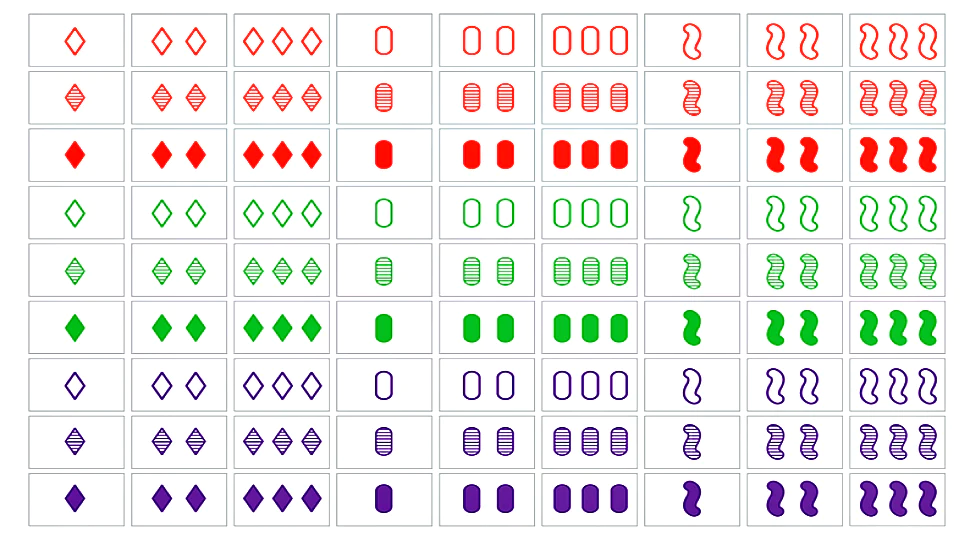

<h1 align="center"><a href=""> Game Of Set ♥️♦️♠️♣️ </a></h1>

## Description

Set (stylized as SET or SET!) is a real-time card game designed by Marsha Falco in 1974 and published by Set Enterprises in 1991. The deck consists of 81 unique cards that vary in four features across three possibilities for each kind of feature: number of shapes (one, two, or three), shape (diamond, squiggle, oval), shading (solid, striped, or open), and color (red, green, or purple). Each possible combination of features (e.g. a card with three striped green diamonds) appears as a card precisely once in the deck.

## Gameplay 
In the game, certain combinations of three cards are said to make up a "set". For each one of the four categories of features—color, number, shape, and shading—the three cards must display that feature as either a) all the same, or b) all different. Put another way: For each feature the three cards must avoid having two cards showing one version of the feature and the remaining card showing a different version.

For example, 3 solid red diamonds, 2 solid green squiggles, and 1 solid purple oval form a set, because the shadings of the three cards are all the same, while the numbers, the colors, and the shapes among the three cards are all different.

For any set, the number of features that are constant (the same on all three cards) and the number of features that differ (different on all three cards) may break down as: all 4 features differing; or 1 feature being constant and 3 differing; or 2 constant and 2 differing; or 3 constant and 1 differing. (All 4 features being constant would imply that the three cards in the set are identical, which is impossible since no cards in the Set deck are identical.)

[](https://github.com/johnsonr84)
[](https://github.com/johnsonr84/react-book-search)
[](https://github.com/johnsonr84/react-book-search)
[](https://choosealicense.com/licenses/mit/)

## Built With

[](https://reactjs.org/)
[](https://vercel.com/)
[](https://code.visualstudio.com/)

## Table of Contents

* [Description](#Description)
* [Gameplay](#Gameplay)
* [Project URL](#Project-URL)
* [Deployment](#Deployment)
* [Demo/Screenshots](#Demo/Screenshots)
* [Installation](#Installation)
* [Usage](#Usage)
* [Credits](#Credits)
* [License](#License)
* [Resources](#Resources)
* [Contact](#Contact)
* [Author](#Author)
#

## Project URL

https://github.com/johnsonr84/game-of-set

## Deployment
https://game-of-set-sigma.vercel.app/


## Demo/Screenshots

<table>
<tr>
    <td>Game Of Set Example</td>
</tr>
<tr>
    <td></td>
</tr>
<tr>
    <td>Game Of Set Deck Of 81 Cards</td>
</tr>
<tr>
    <td></td>
</tr>
</table>

## Technologies

```
React
```

## Installation

Access to GitHub.com and a code editor such as vscode is necessary. Click the GitHub link provided above to the APP REPO. Click on the green button that says Clone or Download and Choose how you would like to download: using the SSH/HTTPS keys or download the zip file. If using SSH/HTTPS Key: You will copy the link shown and open up either terminal (mac: pre-installed) or gitbash (pc: must be installed). Once the application is open, you will type git clone paste url here. If using Download ZIP: Click on Download Zip. Locate the file and double click it to unzip the file. Locate the unzipped folder and open it.

## Usage

In order to use this APP, you need terminal (mac: pre-installed) or gitbash (pc: must be installed). You also need to download and install [node.js](https://nodejs.org/en/) and [npm](www.npmjs.com) or [yarn](https://yarnpkg.com/) package manager. Open the cloned REPO in your favorite code editor, and then in terminal, enter the command “npm i“ or “yarn add”  to install the dependencies. Now you are ready to start using  the app by entering “npm start” on your terminal or gitbash. If you just want to try how the app works, you can go to the link [here](https://game-of-set-sigma.vercel.app/)

## Credits

Me, myself and Irene

## License

This project is [mit](https://choosealicense.com/licenses/mit/) licensed.

## Features

Coming soon maybe

## Available Scripts

In the project directory, you can run:

### `npm start`

Runs the app in the development mode.\
Open [http://localhost:3000](http://localhost:3000) to view it in the browser.

The page will reload if you make edits.\
You will also see any lint errors in the console.

### `npm test`

Launches the test runner in the interactive watch mode.\
See the section about [running tests](https://facebook.github.io/create-react-app/docs/running-tests) for more information.

### `npm run build`

Builds the app for production to the `build` folder.\
It correctly bundles React in production mode and optimizes the build for the best performance.

The build is minified and the filenames include the hashes.\
Your app is ready to be deployed!

See the section about [deployment](https://facebook.github.io/create-react-app/docs/deployment) for more information.

### `npm run eject`

**Note: this is a one-way operation. Once you `eject`, you can’t go back!**

If you aren’t satisfied with the build tool and configuration choices, you can `eject` at any time. This command will remove the single build dependency from your project.

Instead, it will copy all the configuration files and the transitive dependencies (webpack, Babel, ESLint, etc) right into your project so you have full control over them. All of the commands except `eject` will still work, but they will point to the copied scripts so you can tweak them. At this point you’re on your own.

You don’t have to ever use `eject`. The curated feature set is suitable for small and middle deployments, and you shouldn’t feel obligated to use this feature. However we understand that this tool wouldn’t be useful if you couldn’t customize it when you are ready for it.

## Resources

* [Choose a License](https://choosealicense.com/)
* [Badmath](https://img.shields.io/github/languages/top/nielsenjared/badmath)
* [shields.io](https://shields.io/)
* [Create React App documentation](https://facebook.github.io/create-react-app/docs/getting-started)
* [React documentation](https://reactjs.org/)
* [Vercel](https://vercel.com/)

## Contact

Email: robertcjohnson1984@gmail.com 

## Author

Author(s): Rob Johnson  
GitHub: https://github.com/johnsonr84/ 